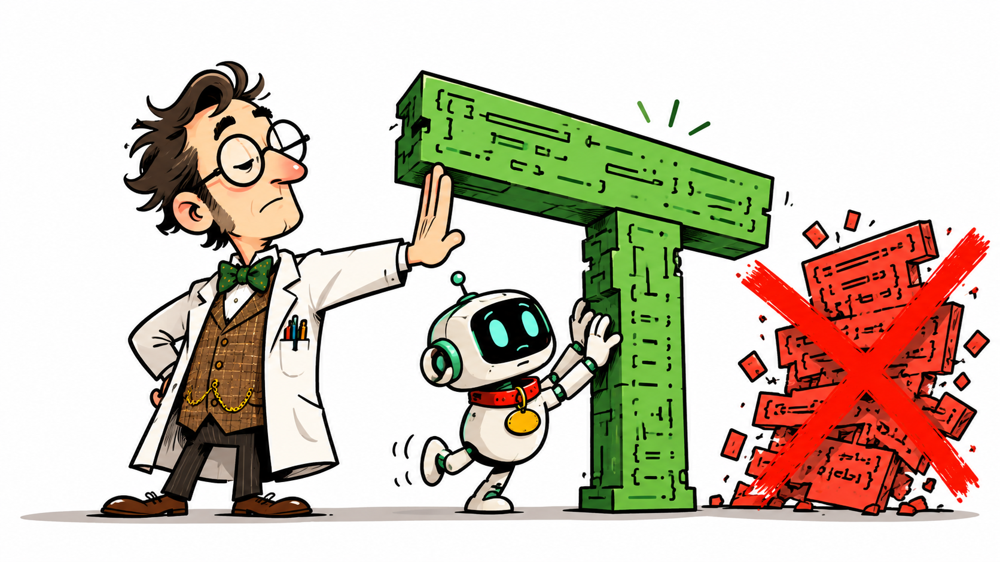

<p align="center">
  
</p>

<h1 align="center">Boffin</h1>

<p align="center"><strong>You asked for a small fix. Your AI agent came back with a renovation.</strong></p>

<p align="center">Boffin is the brilliant, fussy technical expert who reads the diff and refuses to let your coding agent knock out a load-bearing wall.</p>

Boffin gives coding agents the relevant architectural constraints before they
edit, then makes them verify the result. It is powered by **ParselFire Core**.

## Proof, not promises

The public case studies record these guided refactors on real open-source code:

- **[DuckDB](examples/before-after-cpp.md):** `+17 / -17`; 2,104 assertions
  across 8 test files passed; distinct continuation and recovery paths were
  preserved.
- **[FastAPI](examples/before-after-python.md):** `+16 / -33`; 49 tests passed;
  no public API change.
- **[LangChain](examples/before-after-python.md):** the sync/async boundary was
  preserved; 4 tests passed.

These are reproducible case studies, not a controlled A/B benchmark.

## Install

Boffin requires Node.js 18 or newer.

### Cursor

Run from your project:

```sh
npx boffinit cursor
```

### Claude Code

Run these inside Claude Code:

```text
/plugin marketplace add MicSm/boffin
/plugin install boffin@boffin
```

### Codex

Run these from a terminal:

```sh
codex plugin marketplace add MicSm/boffin
codex plugin add boffin@boffin
```

Codex does not trust plugin hooks automatically. Run `/hooks` once inside Codex
to review and trust Boffin's hooks; until then the plugin's skills work but the
automatic per-session activation stays off.

### OpenCode

Run from your project:

```sh
npx boffinit opencode
```

Then open the project in OpenCode. Always-on guidance lands via
`opencode.json` -> `.boffin/AGENTS.md`. On demand: `/boffin`,
`/boffin-review`, or the `boffin` / `boffin-review` skills.

Install details, commands, and troubleshooting:
**[OpenCode delivery](docs/opencode.md)**.

Want the machinery? Read **[how ParselFire Core works](docs/engine.md)**.

## What Boffin is fussy about

Similar code is not always the same code. Boffin gives the agent a reason to
stop before it merges a real special case, blurs a sync/async boundary, moves
state away from its owner, or turns a focused task into a tour of the codebase.

- For a focused change, it keeps the requested scope small and asks for the
  narrowest check that proves the edit.
- For an open-ended refactor or review, it requires a read-only audit first,
  followed by one verified finding at a time.
- When cleanup conflicts with an earlier correctness rule, correctness wins.

The point is not to make the agent timid. It is to make the expensive details
explicit before they become an interesting afternoon.

## Other hosts

Portable adapters cover hosts that read `AGENTS.md`, `CLAUDE.md`, workspace
rules, or repository instructions. See
**[host delivery and adapters](docs/engine.md#host-delivery-and-adapters)** for
the technical map.

## FAQ

### What do `lite`, `full`, and `max` change?

They tune cleanup ambition, not correctness:

- `lite` keeps cleanup pressure low and favors the smallest useful change.
- `full` is the balanced default.
- `max` applies the strongest cleanup pressure when the task justifies it.

On plugin hosts, select a profile with `/boffin lite`, `/boffin full`, or
`/boffin max`. There is no `off` profile.

### Do profiles change the safety floor?

No. Every profile keeps the same early correctness stages and rejection rules,
including trust-boundary validation, data-loss prevention, security, and
accessibility requirements.

### Is Boffin a command sandbox or security tool?

No. Boffin does not isolate processes, filter shell commands, or restrict
filesystem or network access. It guides architectural decisions in generated
code. Use command sandboxes and security controls for their own job; Boffin has
a different job.

### How do I uninstall the Cursor or OpenCode integration?

```sh
npx boffinit cursor uninstall
npx boffinit opencode uninstall
```

Each uninstaller removes that host's managed files only. Shared
`.boffin/packs` and `.boffin/VERSION` stay if the other host is still
installed. Unrelated project files are left alone.

### Does Boffin replace tests or code review?

No. It tells the agent which contracts deserve attention and requires external
checks, but your repository's tests and review process remain authoritative.

## Project

- Repository: <https://github.com/MicSm/boffin>
- Engine documentation: [ParselFire Core](docs/engine.md)
- Evidence: [Python](examples/before-after-python.md) and
  [C++](examples/before-after-cpp.md)
- Contributions: [CONTRIBUTING.md](CONTRIBUTING.md)

Boffin is available under the [MIT License](LICENSE). See [credits](CREDITS).
